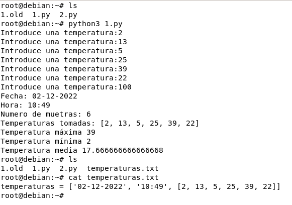

# Instalación:
Se hace un pull del portainer y luego corremos un contenedor con ello y accedemos desde el puerto 9000 del equipo usando un volumen propio con los siguientes comandos 

- docker volume create portainer_data
- docker pull portainer/portainer-ce
-docker run -d --name=Portainer --hostname=Portainer --network=host --restart=always -v /var/run/docker.sock:/var/run/docker.sock -v portainer_data:/data -e TZ='Europe/Madrid' portainer/portainer

