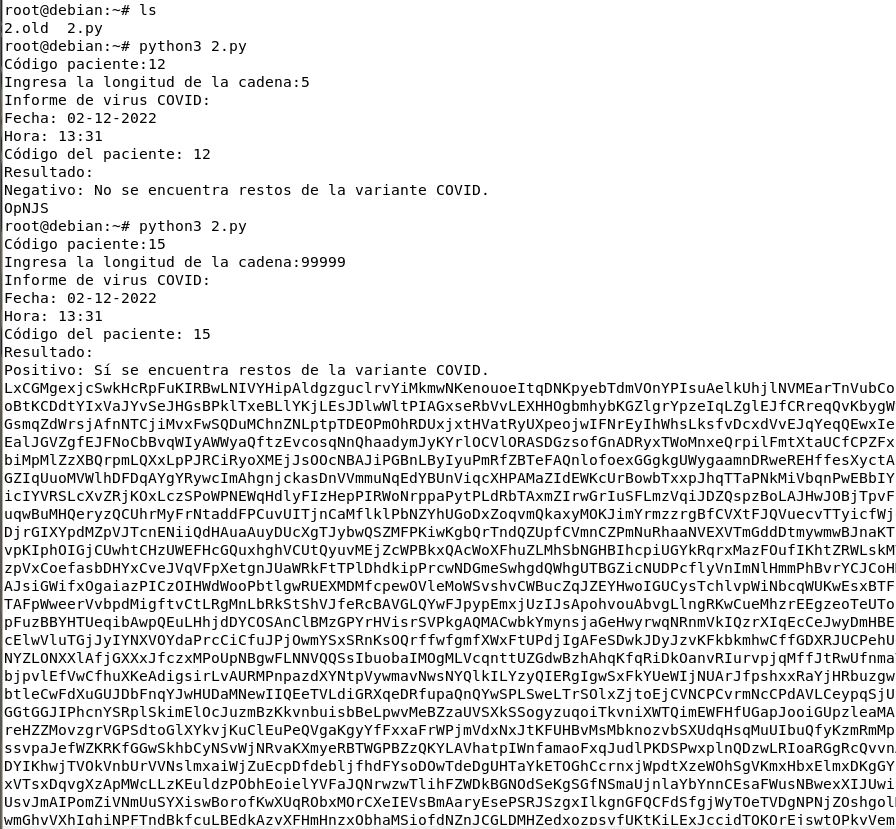

# Descripción panel de control:
#### Dashboard
como vemos en la siguiente imagen es una forma mas ordenada de ver opciones del menú de la izquierda y se encuentran las mas usadas como imagenes, voumen , contenedores y de informa de cuantos tienes funcionando 

#### app templates
plantillas predefinidas para crear contenedores
#### Networks
para trabajar con redes
#### containers 
para trabajar con contenedores 

#### stacks
#### Dashboard

