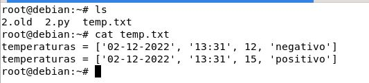

# Descripción panel de control:

Como vemos en la siguiente imagen es una forma mas ordenada de ver opciones del menú de la izquierda y se encuentran las mas usadas como imagenes, voumen , contenedores y de informa de cuantos tienes funcionando 

## app templates
Plantillas predefinidas para crear contenedores

## Networks
Para trabajar con redes
## containers 
Para trabajar con contenedores 

## stacks, Dashboard, settings, etc 
Opciones y distintas funciones

