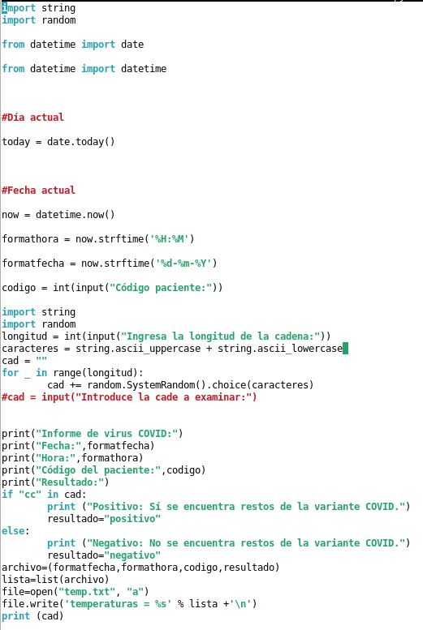
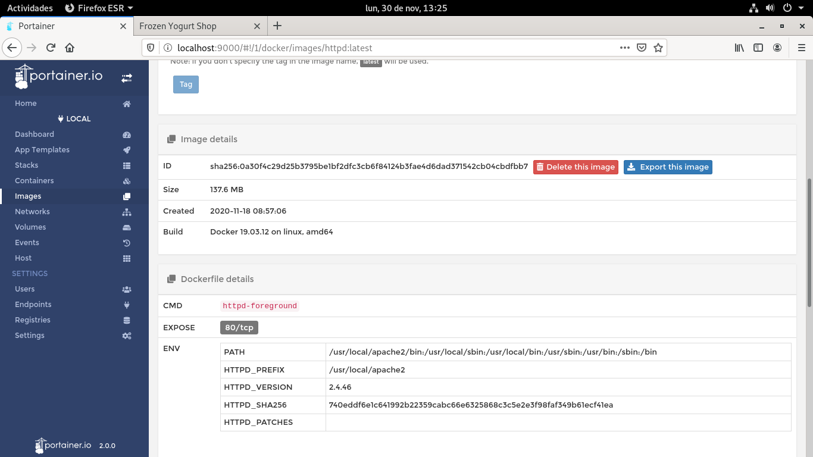
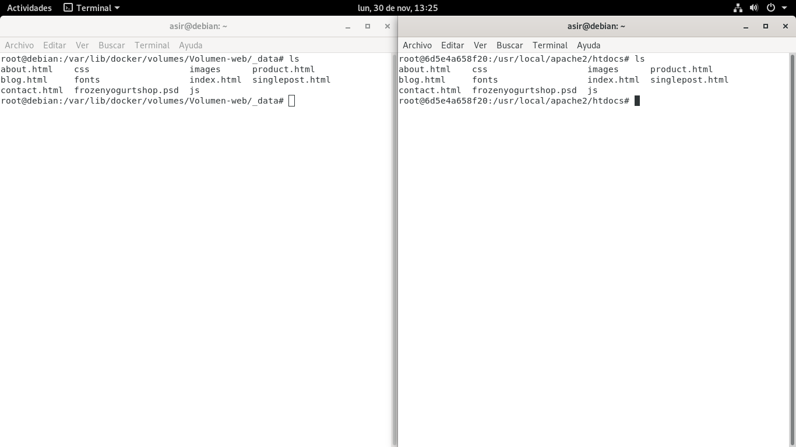

# Página:
### Para crear la página tenemos que crear primero un volumen donde pondremos la información de la web que nos descargamos previamente 

### Vamos a las plantillas y modificamos la de apache mapeando el puerto del pc 8082 con el 80 de la máquina de apache que se creará

### También juntaremos el volumen creado antes con la carpeta donde se guarda el index de apache para que funcione el sitio web en /usr/local/apache2/htcdocs/

### Por ultimo accedemos por el puerto deseado desde el navegador y podríamos acceder a la web creada 

